# Exercism - JS
> Como forma de alinhar a base do conhecimento de todas participantes do React Ladies, decidimos relizar os desafios da trilha de javascript na plataforma [Exercism.io](https://exercism.io/), junte-se ao nosso grupo pra acompanhar as soluções das participantes e se divertir conosco, [acesse esse link para entrar no nosso time](https://teams.exercism.io/teams/jFu9X5t7phBcZ2ntGdRvS3ck/join)

- 1 [Por onde começar?](#por-onde-começar)
- 2 [Faça parte do nosso time](#faça-parte-do-nosso-time)
- 3 [Como deixar suas soluções disponíveis no grupo do React Ladies na plataforma do exercism.io?](#como-deixar-suas-soluções-disponíveis-no-grupo-do-react-ladies-na-plataforma-do-exercism.io)
- 4 

## Por onde começar?
- 1 - [Acesse esse link](https://exercism.io/) e crie uma conta:

  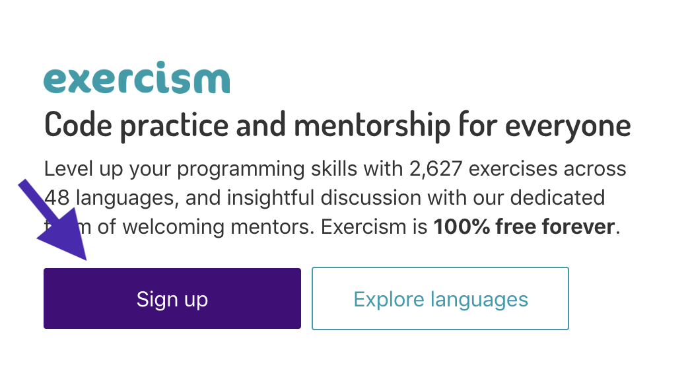

- 2 - Você pode usar seu github 💜

  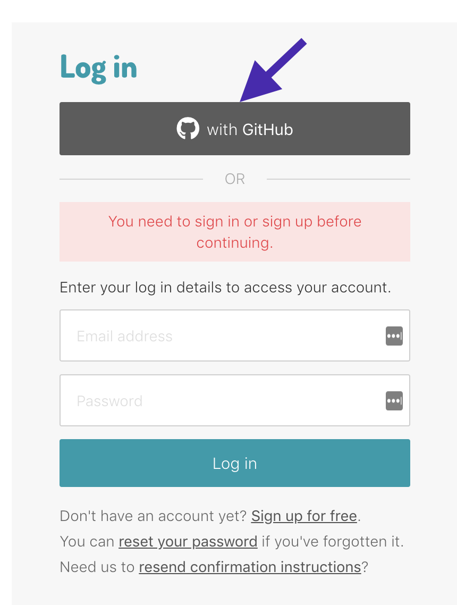

- 3 - Aceite os termos de serviços, políticas de privacidade e Clique em salvar para continuar.

  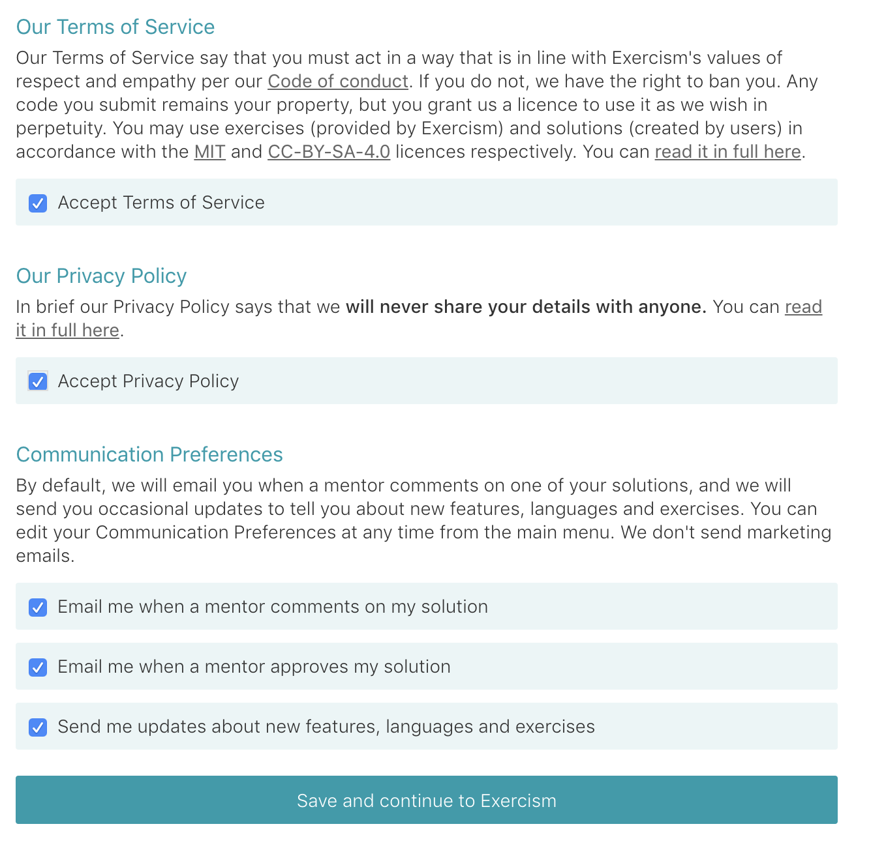

-  4 - Yeahhhh, agora é só procurar a trilha de javascript e clicar no botão abaixo pra começar a ser feliz 😍

    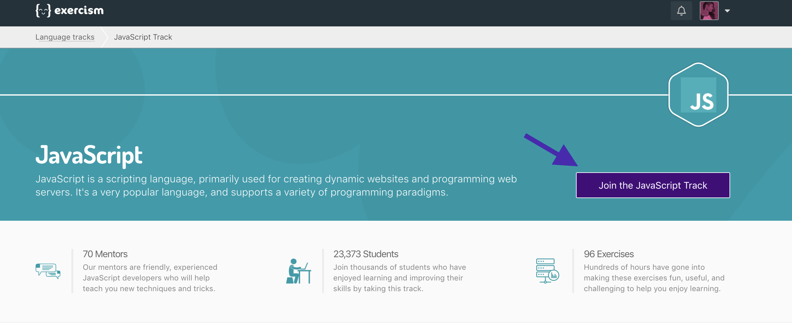

- 5 - Escolha o modo mentorado.
  

 - 6 Clique em continuar.
  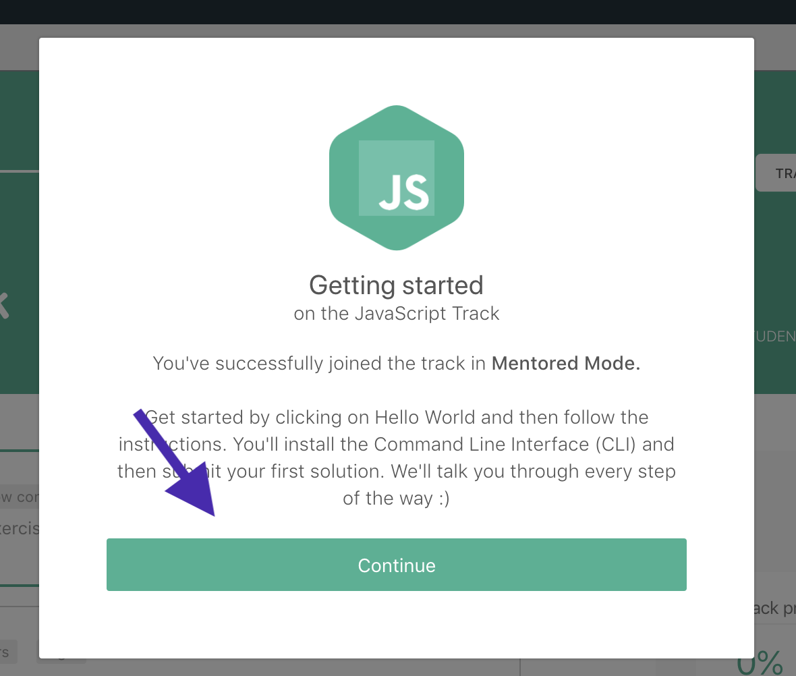

 - 7 Pronto, agora você pode visualizar todos os desafios disponíveis e começar a brincar.

    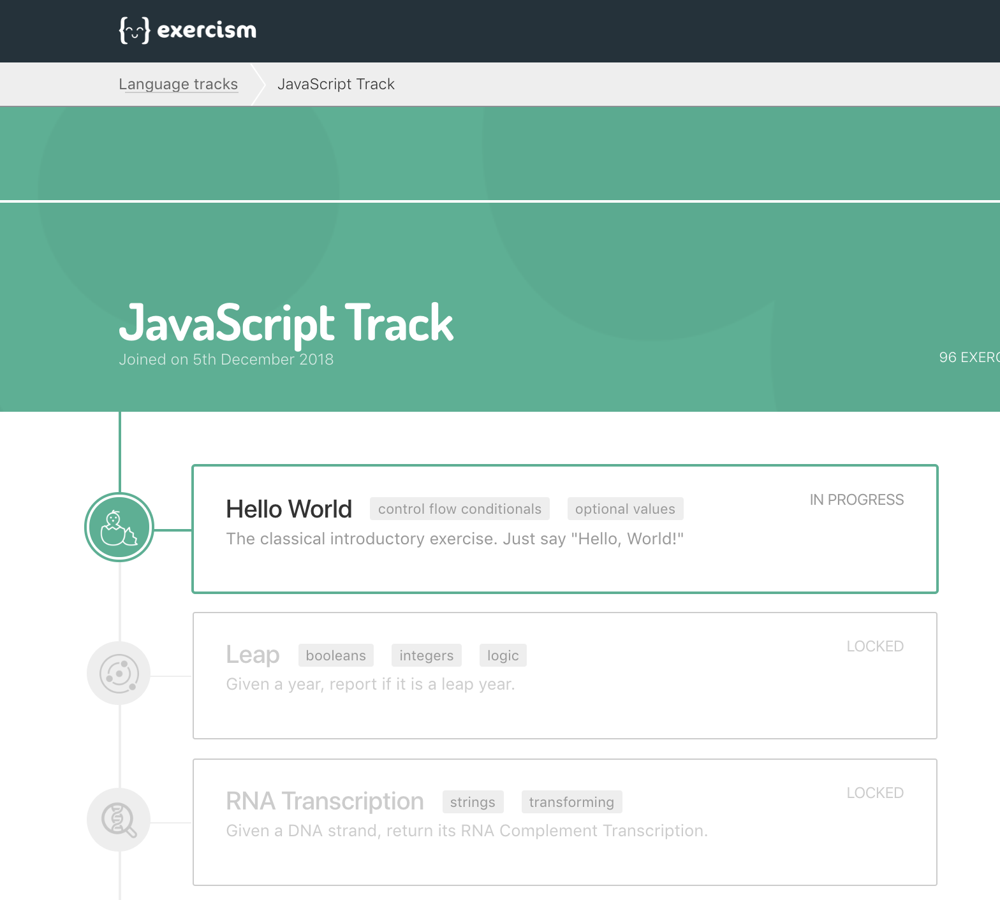

  ---

 ## Faça parte do nosso time?
  - Agora você pode clicar no link informado no início desse documento e fazer parte do nosso grupo na plataforma do Exercise.io.

    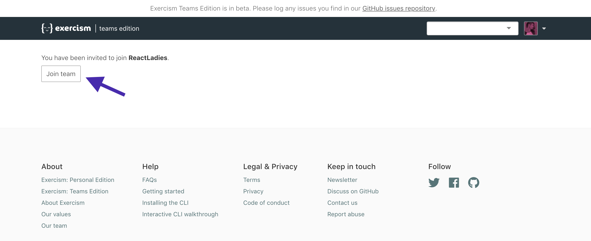

---

## Como deixar suas soluções disponíveis no grupo do React Ladies na plataforma do exercism.io?
- 1 Se você estiver no modo `teams edition`, vá par o modo `personal edition`.

    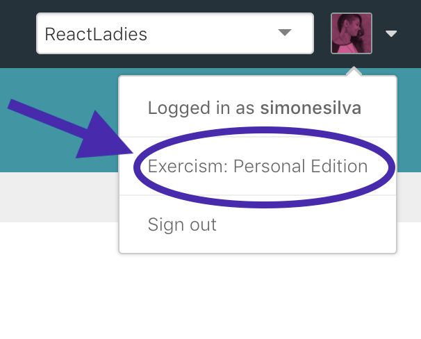

- 2 Escolha a trilha de javascript

  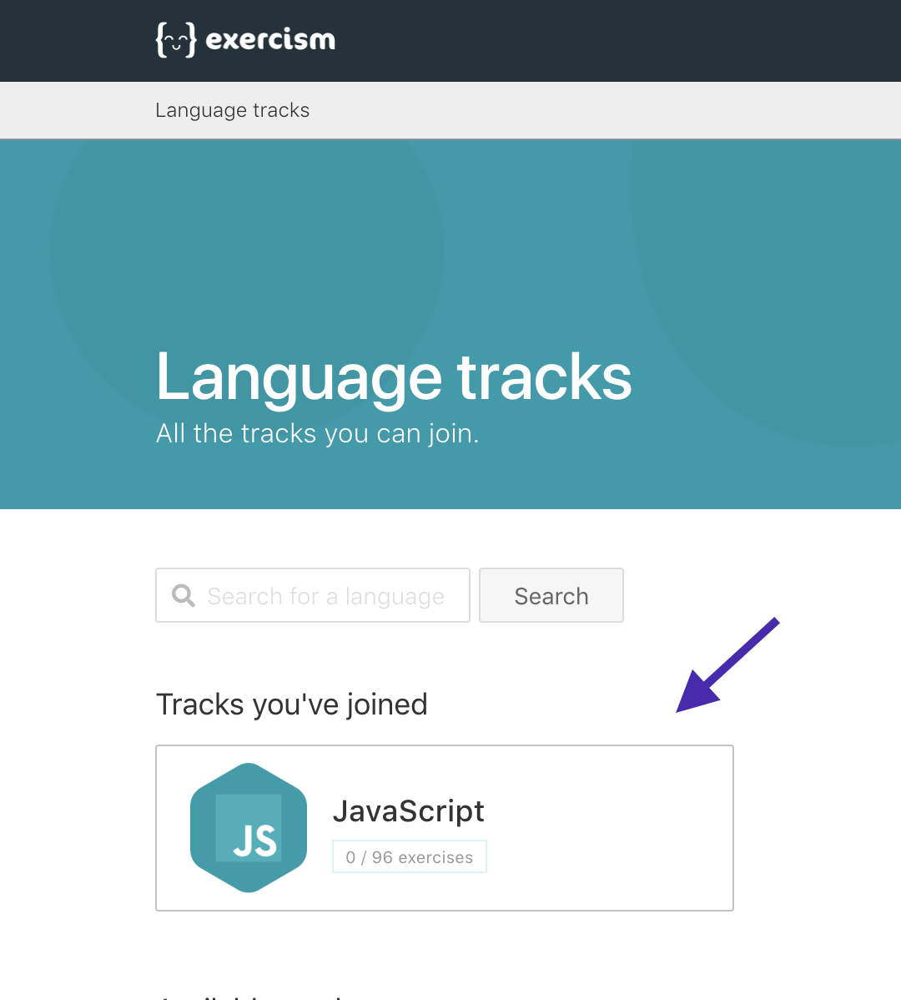

- 3 Veja o nome do primeiro desafio disponível na trilha, você irá precisar dele para inserir lá no grupo do React Ladies.

    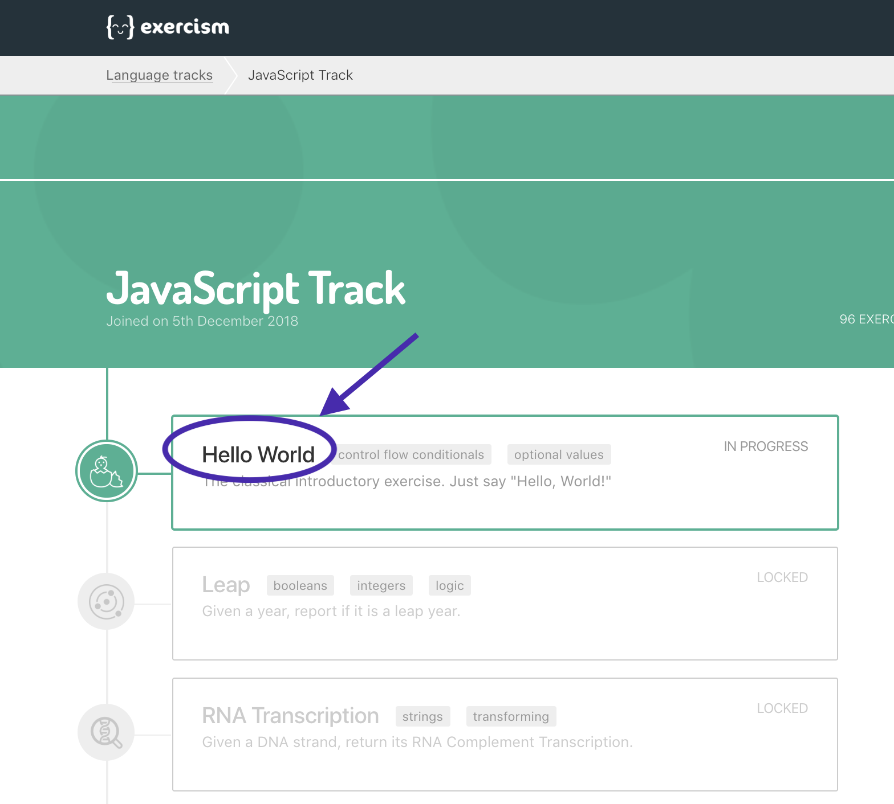

- 4 Vote para o modo  `teams edition`.

    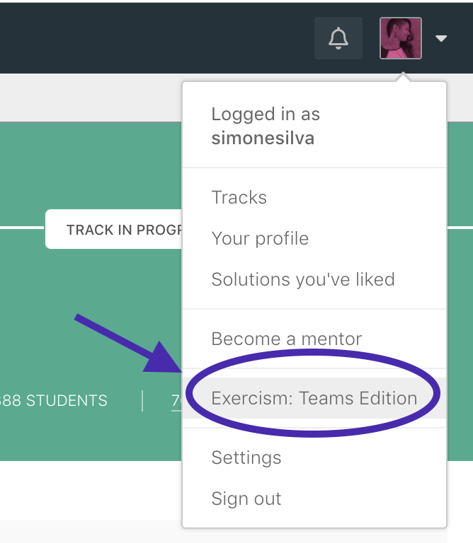

- 5 Clique no time React Ladies

    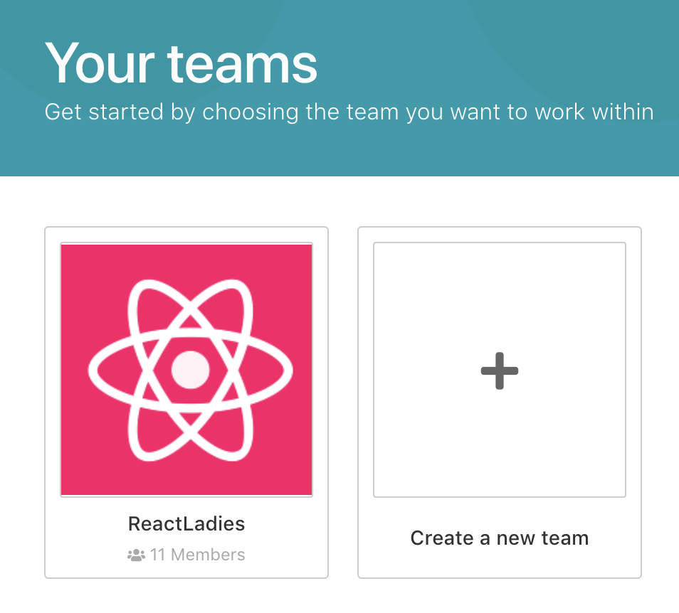

- 6 Vá para a sessão `your solutions` e clique em `start a new solution`.

    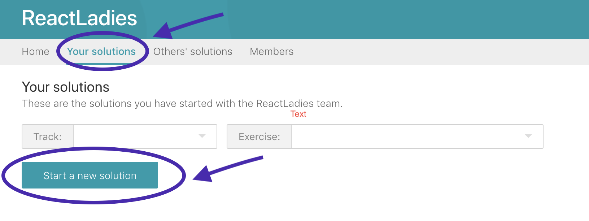

- 7 Em `track` selecione `javascript` e nos resultados abaixo procure pelo primeiro desafio `Hello world`

    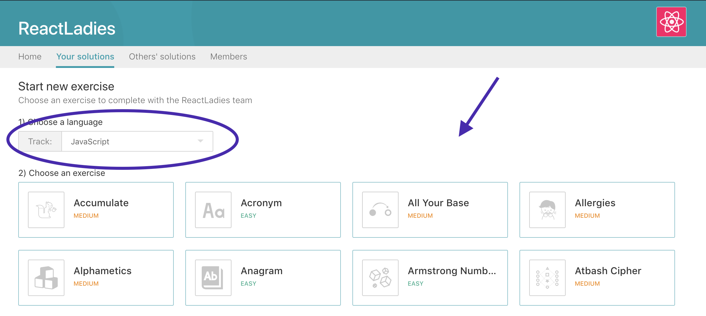

- 8 Clique no botão da sessão `Get Started` e siga os passos indicados lá para resolver sua solução.

  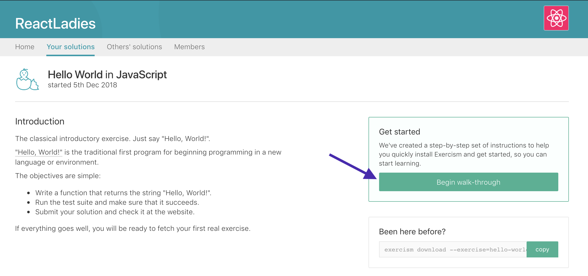