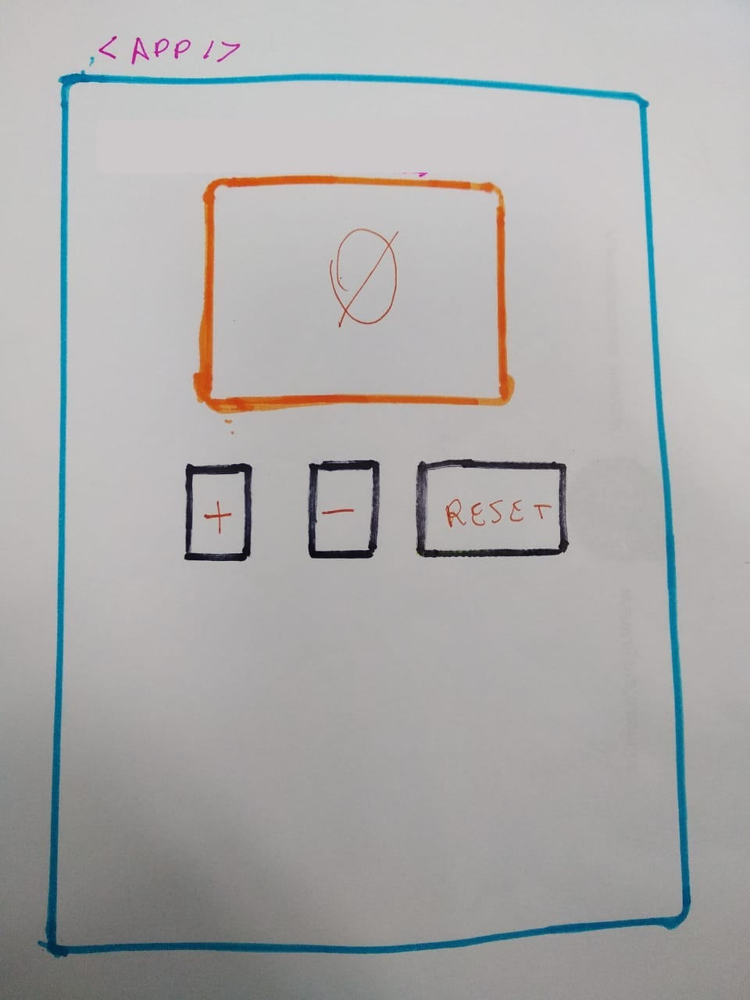

# React Count ➕  0️⃣ ➖ 

- 0️⃣ Crie uma aplicação que possui um campo com o valor inicial zero (0). 
- Adicione três botões:
  - ➕ um botão que mostra o sinal positivo e quando o usuário clicar nesse botão ele irá adicionar um ao valor inicial.
  - ➖  um botão que mostra o sinal negativo e quando o usuário clicar nesse botão ele irá subtrair um do valor inicial.
  - Um botão com o nome RESET que irá alterar o valor inicial para o valor zero